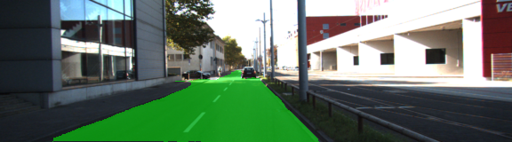
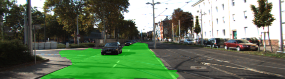
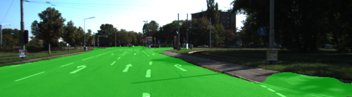
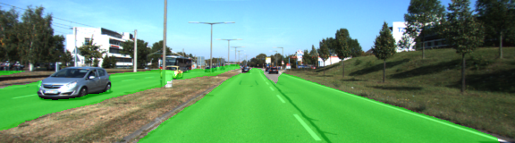
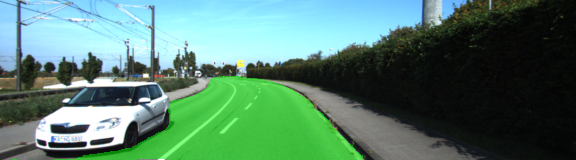
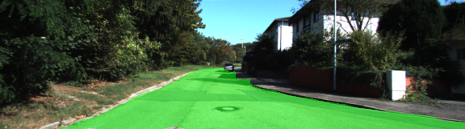

# Semantic Segmentation
### Introduction
In this project, you'll label the pixels of a road in images using a Fully Convolutional Network (FCN).

### Code description

|   |
|---|
|The code run via main.py, Vgg model is downloaded and input is extracted to work on NN   |
|One convolutional layer with kernel 1 from VGG's layer 7 |
|One deconvolutional layer with kernel 4 and stride 2 from the first convolutional layer   |
| One convolutional layer with kernel 1 from VGG's layer 4  |
|The two layers above are added to create the first skip layer |
|One deconvolutional layer with kernel 4 and stride 2 from the first ship layer|
|One convolutional layer with kernel 1 from VGG's layer 3 .|
|The two layers above are added to create the second skip layer .|
|One deconvolutional layer with kernel 16 and stride 8 from the second skip layer .|


Once the network structure is defined, the optimizer and the cross-entropy lost is defined on the optimize method using Adam optimizer, we can also use means square loss but Adam optimizer is much better.

The network is trained using the train_nn, using keep probability 0.5 and learning rate of 0.00009 with 51 epoch.

### Result images
| |
|--|
||
||
||
||
||
||
||


### Setup
##### GPU
`main.py` will check to make sure you are using GPU - if you don't have a GPU on your system, you can use AWS or another cloud computing platform.
##### Frameworks and Packages
Make sure you have the following is installed:
 - [Python 3](https://www.python.org/)
 - [TensorFlow](https://www.tensorflow.org/)
 - [NumPy](http://www.numpy.org/)
 - [SciPy](https://www.scipy.org/)
##### Dataset
Download the [Kitti Road dataset](http://www.cvlibs.net/datasets/kitti/eval_road.php) from [here](http://www.cvlibs.net/download.php?file=data_road.zip).  Extract the dataset in the `data` folder.  This will create the folder `data_road` with all the training a test images.

### Start
##### Implement
Implement the code in the `main.py` module indicated by the "TODO" comments.
The comments indicated with "OPTIONAL" tag are not required to complete.
##### Run
Run the following command to run the project:
```
python main.py
```
**Note** If running this in Jupyter Notebook system messages, such as those regarding test status, may appear in the terminal rather than the notebook.

 ### Tips
- The link for the frozen `VGG16` model is hardcoded into `helper.py`.  The model can be found [here](https://s3-us-west-1.amazonaws.com/udacity-selfdrivingcar/vgg.zip).
- The model is not vanilla `VGG16`, but a fully convolutional version, which already contains the 1x1 convolutions to replace the fully connected layers. Please see this [post](https://s3-us-west-1.amazonaws.com/udacity-selfdrivingcar/forum_archive/Semantic_Segmentation_advice.pdf) for more information.  A summary of additional points, follow. 
- The original FCN-8s was trained in stages. The authors later uploaded a version that was trained all at once to their GitHub repo.  The version in the GitHub repo has one important difference: The outputs of pooling layers 3 and 4 are scaled before they are fed into the 1x1 convolutions.  As a result, some students have found that the model learns much better with the scaling layers included. The model may not converge substantially faster, but may reach a higher IoU and accuracy. 
- When adding l2-regularization, setting a regularizer in the arguments of the `tf.layers` is not enough. Regularization loss terms must be manually added to your loss function. otherwise regularization is not implemented.
 